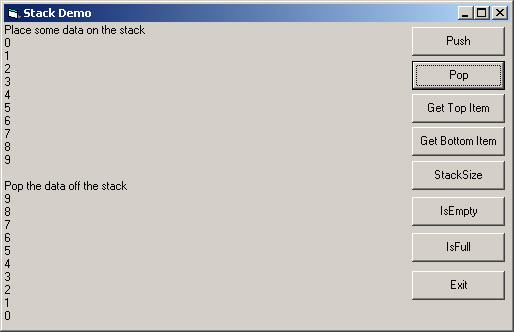



## CStack

### Description

Was just looking tho one of my C++ books and came accross a stack class. so I desided since had nothing better to do and convert it to VB. anyway I done it as a class and added some other features. comes with evey line commented and a small example. hope you can find a use for it.
 
### More Info
 

             |
---                |---
**Submitted On**   |2005-04-01 13:51:02
**By**             |[dreamvb](https://github.com/Planet-Source-Code/PSCIndex/blob/master/ByAuthor/dreamvb.md)
**Level**          |Beginner
**User Rating**    |5.0 (10 globes from 2 users)
**Compatibility**  |VB 5\.0, VB 6\.0
**Category**       |[Object Oriented Programming \(OOP\)](https://github.com/Planet-Source-Code/PSCIndex/blob/master/ByCategory/object-oriented-programming-oop__1-47.md)
**World**          |[Visual Basic](https://github.com/Planet-Source-Code/PSCIndex/blob/master/ByWorld/visual-basic.md)
**Archive File**   |[CStack187056412005\.zip](https://github.com/Planet-Source-Code/dreamvb-cstack__1-59779/archive/master.zip)

